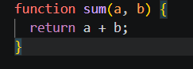
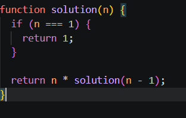
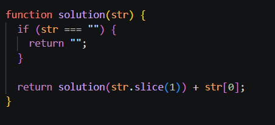

# -что такое JavaScript 
JavaScript — это язык программирования для создания интерактивных сайтов.
Он делает сайты «живыми»: кнопки, анимации, формы и т.д.

# Data type в JavaScript — это 2 вида:

Primitive 
Object 

# Primitive:

string 

number 

boolean 

null 

undefined 

bigint 

symbol 

# Object:

object (включает массивы, функции и т.д.)

# Declaration

функция с именем  

можно вызвать с именем

 есть hoisting

 # Expression

 функция без “прямого объявления”, 
 
 через переменную
 вызывается через переменную

 
hoisting как у функции НЕ работает

 # Методы для работы со строками (String Methods)
Эти инструменты нужны для «хирургии» над текстом, его очистки и поиска

Навигация и доступ:
* at() — современный стандарт для получения символа по 
индексу (поддерживает отрицательные индексы для счета с конца)

* charAt() — классический способ получения символа

* includes() — проверяет, содержит ли строка определенное слово (возвращает «да» или «нет»)

* indexOf() — находит точную позицию (индекс) символа или подстроки

* startsWith() и endsWith() — проверяют, чем начинается или заканчивается текст

* Извлечение частей:
slice() — самый гибкий и предсказуемый метод для вырезания части строки

* split() — разрезает строку и превращает её в массив (список)

* Трансформация и очистка:
trim() — удаляет лишние пробелы в начале и конце

* toLowerCase() — делает все буквы маленькими

* replace() — заменяет одну часть текста на другую

 # Методы для работы с числами и математикой (Number & Math)
Они необходимы для точных вычислений и преобразования данных

* Number() — превращает строку в число      

* toString() — превращает число обратно в строку

* isNaN() — безопасная проверка на то, является ли значение числом

* Math.floor() — округление всегда вниз

* Math.ceil() — округление всегда вверх

* Math.round() — округление по математическим правилам

* Math.abs() — находит модуль числа (убирает минус)

* Math.pow() и Math.sqrt() — возведение в степень и извлечение корня

* Math.max() и Math.min() — поиск самого большого и самого маленького числа в наборе

* Math.random() — создание случайного числа

# Recursion   
Рекурсия в JavaScript — это когда функция вызывает саму себя. Чтобы остановить цикл, нужно добавить внутри if
 * пример 

 

# Closure 
Closure (замыкание) в JavaScript — это когда внутренняя функция помнит переменные внешней функции даже после её завершения

